# Vue前端工程规范

## 目录

1. **assets**：存储静态资源CSS、scss、less、图片、json
2. **base-ui**：通用组件，命名方式为kebab-case（短横线分隔命名）
3. **components**：页面组件，命名方式为kebab-case（短横线分隔命名）
4. **directive**：全局自定义指令
5. **global**：引用全局自定义指令、全局组件、全局.....
6. **hook**：hook是Vue3项目中的文件夹，Vue2项目不需要
7. **router**：路由
8. **service**：请求
9. **store**：全局的状态管理
10. **theme**：风格管理
11. **utils**：一些工具方法
12. **views**: 视图，命名方式为PascalCase（大驼峰形式）

## assets
  
1. 从图中可以看出，通用scss文件和变量的scss文件在vite配置后就不需要在assets下的scss文件下导出了，在配置文件引用的scss文件可以在任意的.vue文件下访问到变量和继承类名
2. 在index.scss引入的其它插件的覆盖scss

## base-ui
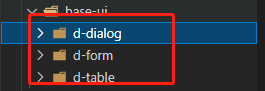
1. 主要是存放一些全局的通用组件自已写的，或者是基于UI框架二次封装的组件（注意：可以使用该UI框架的80%以上的API功能配置）

## components
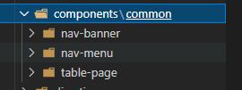
1. 放置基于一些业务封装的通用组件，common都通用，如果是基于某个页面封装，请在components新建一个该页面名称的文件夹，然后新建一个名为index.vue的文件以方便引用

## directive
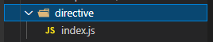
1. 新建一个index.js文件，需要的指令再新建其它xxxx.js文件，然后通过index.js统一导出

## global
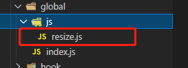 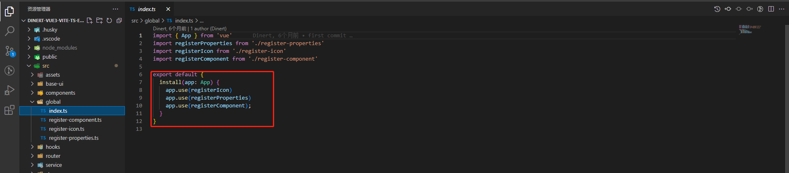 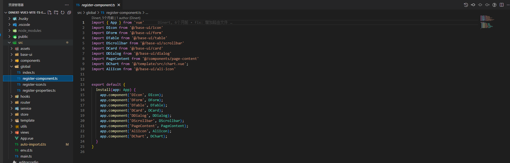 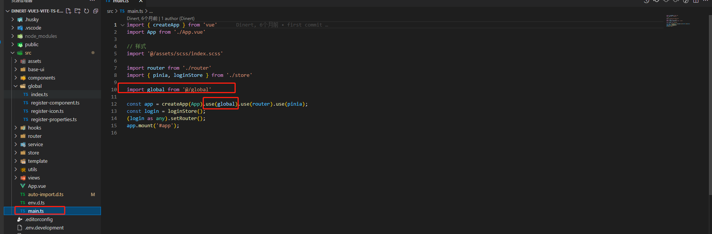
1. 在Vue3中全局global其实没有多大用处，因为在还要用import导入全局的形式来引入全局属性，而在Vue2中可以用this的方式，所以在Vue2中可以新建一个component.js，然后按需引入需要的组件，通过index.js导入然后在全局中注册再通过this访问

## hook
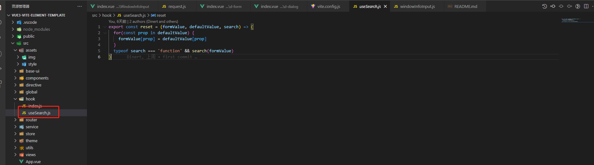
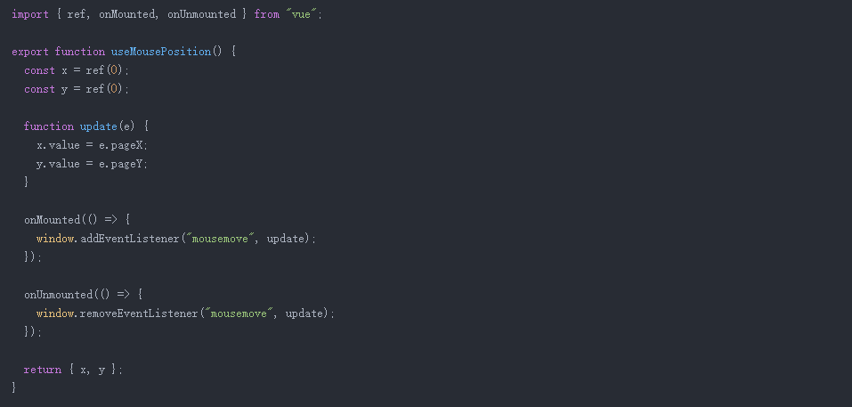
1. hook是Vu3的一个新特性，其实react是最早提出的这个概念，用过Vue2的可以当作用mixin来用，不过可比mixin好用多了，不用引用来引用去，还层层嵌套，太麻烦了。比如你可以在hook下建一个echarts的文件夹，然后新建usePie、useSpline等等，使用这些不同的图表，如果有主题或默认配置，那就新建一个useDefault.js然后在这些图表中引入即可（文件的命名方式必需以use开头的小驼峰的命名规则）。

## rouetr和service
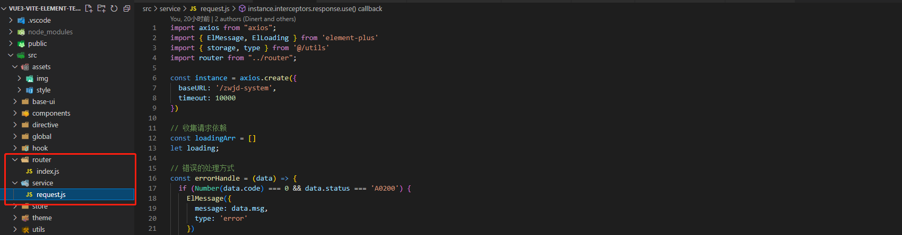
1. 这两个其实就是路由和请求的管理，这边就不需要过多的阐述了

## store
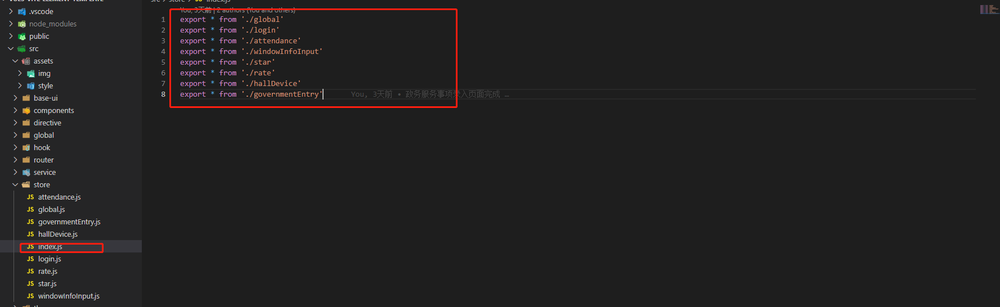
1. store就是全局状态管理工具，这里我并没有采用vuex来做管理，而是用pinia（未来的vuex5），但尤大的意思就是一直用pinia未来不会改为vuex5了，相比于以前的vuex，pinia去除了mutation，而且更轻量级。具体使用可以看官方.
2. 我也是用了index.js分别对其它全局状态做导入导出的管理

## theme
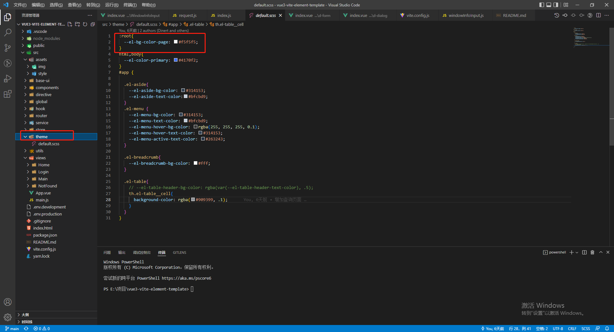
1. theme主题文件，可以通过引入不同的scss来更换不同的主题。暂时还不支持动态切换

## utils
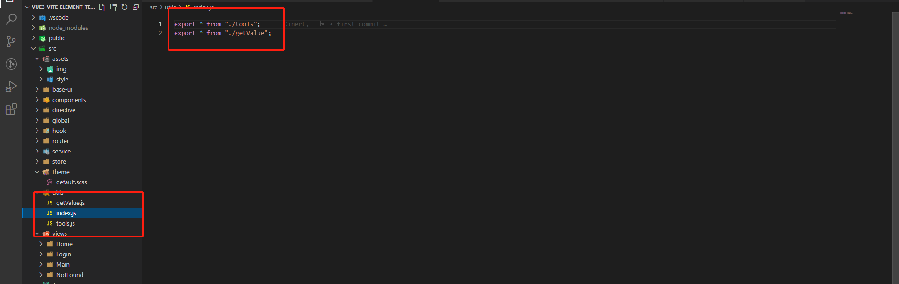
1. 也是通过index.js做导入导出的统一管理
   
## views
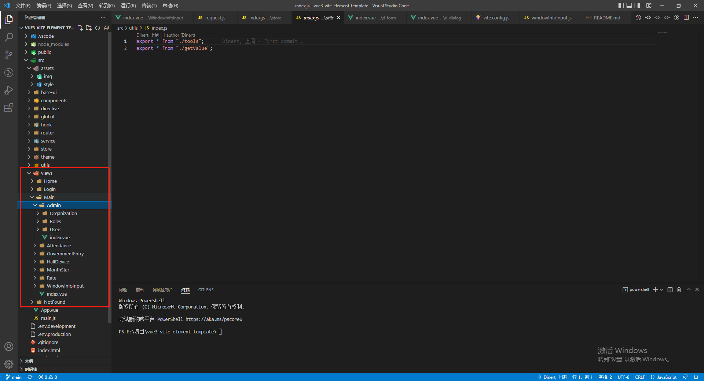
1. 视图路由，文件夹命名方式为大驼峰形式，下面再新建一个index.vue文件
   
  
