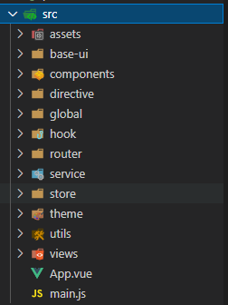
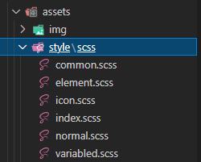
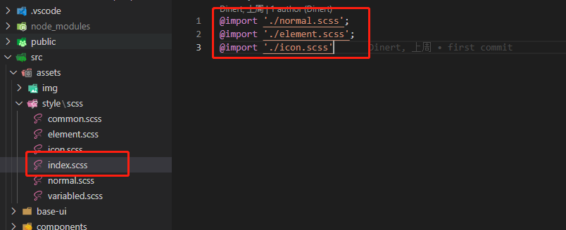
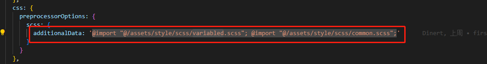

# Vue前端工程规范

## 目录

1. **assets**：存储静态资源CSS、scss、less、图片、json
2. **base-ui**：通用组件，命名方式为kebab-case（短横线分隔命名）
3. **components**：页面组件，命名方式为kebab-case（短横线分隔命名）
4. **directive**：全局自定义指令
5. **global**：引用全局自定义指令、全局组件、全局.....
6. **hook**：hook是Vue3项目中的文件夹，Vue2项目不需要
7. **router**：路由
8. **service**：请求
9. **store**：全局的状态管理
10. **theme**：风格管理
11. **utils**：一些工具方法
12. **views**: 视图，命名方式为PascalCase（大驼峰形式）

## assets
  
  