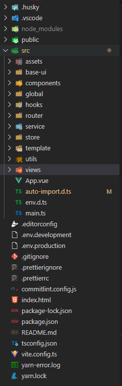

## Vue3+Vite+TypeScript

#### Vue.js 3.0 正式发布于2020年09月18日

#### Vite 2.0 正式发布于2021年2月17日

#### vite如何创建一个项目
```yarn create vite```

#### vite支持的功能，列举一部分
+ 热更新
+ 设置别名
+ 在任何地方加载scss变量
+ 异步加载图片

#### vite缺点
+ 不支持引入vue文件取消后缀名
  - ```import Resolve from '@/views/resolve/index.vue'``` 正确
  - ```import Resolve from '@/views/resolve'``` 这样子文件会报错

#### 安装好用的插件
+ unplugin-vue-components nplugin-auto-import 自动导入Element-plus的样式和组件


#### 文件目录结构
   
  + assets —— 静态资源文件夹
  + base-ui —— 公共组件
  + components —— 项目组件
  + global —— 全局引入组件、图标、属性....
  + hooks 
  + router —— 路由
  + service —— 请求封装
  + store —— 全局状态管理
  + utils —— 工具方法
  + views —— 视图组件
  + auto-import.d.ts —— 自动引入的依赖
  + vite.config.ts —— 配置文件


